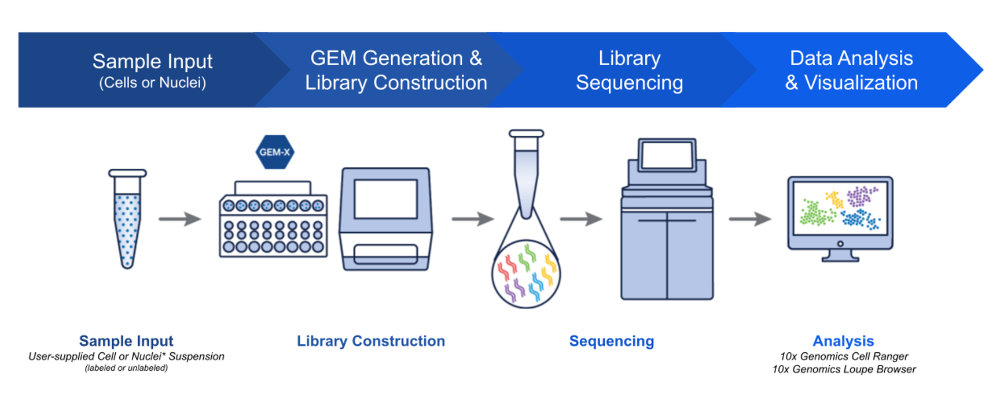
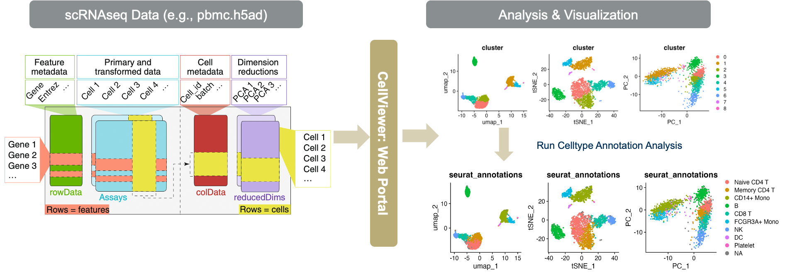
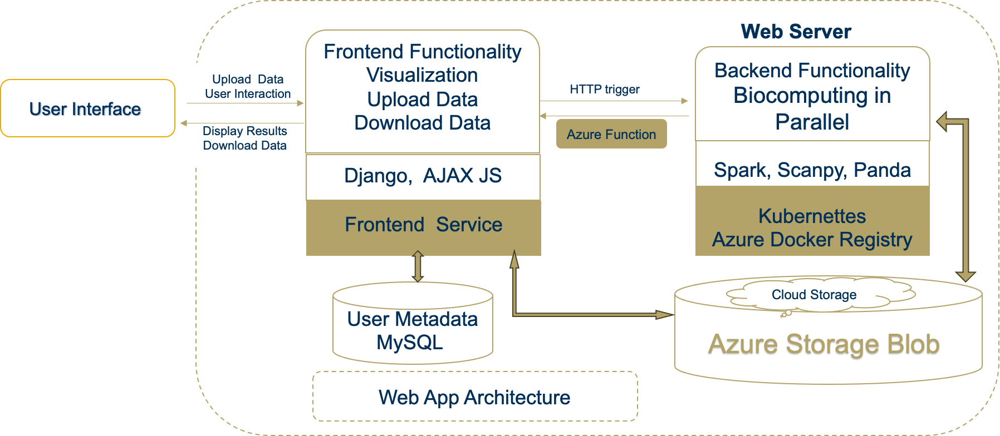

# Cell Viewer - a Web APP for Single Cell Data Analysis and Visualization[^1]

## Introduction

### scRNA-seq data analysis web portals serve as vital tools in biological research.

Figure 1. Procedure of Single Cell Experiments in Labs

Figure 2. Functions of **Cell Viewer**

### Cell Viewer will help researchers visualize and analysis data in an easy way.

-- Web apps make scRNA-seq data analysis more **accessible** to researchers without extensive computational expertise.

-- Provide **standardized and reproducible analysis**, which is crucial for ensuring consistent results across different studies.

-- More **advanced visualization** that help in the interpretation of complex datasets, allowing users to visualize data in various formats that highlight different aspects of the data, such as gene expression patterns, clustering of cell types. 

-- Offer **interactive analysis** capabilities, allowing users to tweak parameters and instantly see how changes affect results

## Implementation

Figure 3. Framework of **Cell Viewer** 

## Functionalities

-- Visualize original data

-- Support customized data analysis on the backend

-- Visualize analyzed data

-- Reorganize data and download

## Codes

All codes are in the [private repositary](https://www.openai.com). 
Please reach me chenqingxiao1020@gmail.com for codes and more.

[^1]:This web app is derived and extended from a project I designed and implemented in course *System Design of Cloud Computing* CS6211, Gatech OMSCS program.
